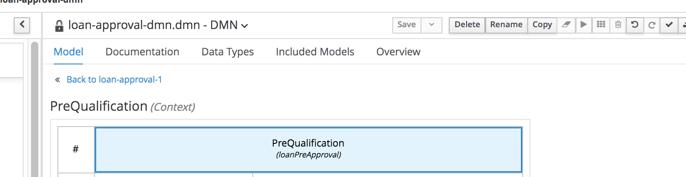
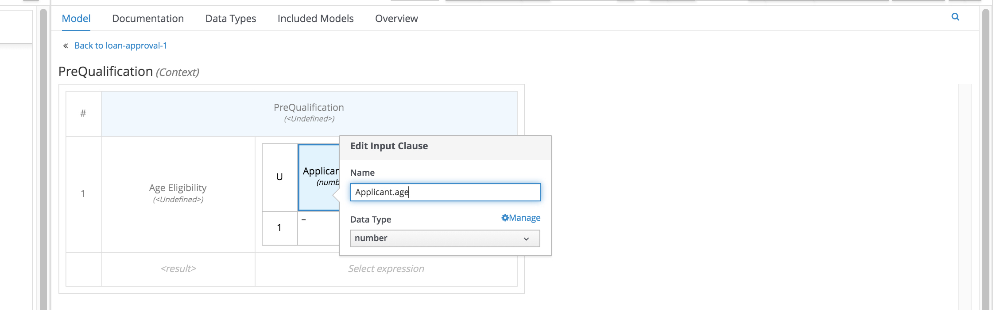
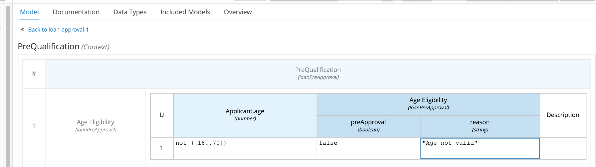

:scrollbar:
:toc2:

== Red Hat Process Automation Manager Workshop - DMN
This workshop is aimed at providing hands on experience creating DMN assets. This lab will implement a Loan Approval workflow. 

.Goals
* Define a Loan Pre Approval Decision flow using DMN
* Test the DMN asset using the Test Scenario tooling
* Build and deploy the DMN asset
* Test the Decision execution using REST APIs
* Test the Decision execution using JAVA APIs

.Prerequisite
* Successful completion of the _Environment Setup Lab_
or
* An existing, accessible, DM/PAM 7.5+ environment.

:numbered:

== Problem Statement
In this lab we will create an Loan Approval process.

* Customer initiates the Loan Approval request. 
* Age and Pre Qualification checks are applied to the loan request.

+
image:images/DMN_img1.jpg[]
+

== Create a Project
To define and deploy a business process, we first need to create a new project in which we can store the DMN model. To create a new project:

. Navigate to {business_central}
. Login to the platform with the provided username and password.
. Click on **Design** to navigate to the Design perspective.
+
image:images/space_view.jpg[]
+

. In the Design perspective, create a new project. If your space is empty, this can be done by clicking on the blue **Add Project** button in the center of the page. If you already have projects in your space, you can click on the blue **Add Project** icon at the top right of the page.
. Give the project the name `loan-approval`, and the description "Loan Approval Process".
+
image:images/create_project.jpg[]
+

With the project created, we can now start building our solution.

== Solution

=== The Domain Model

The business process will collect and carry data through the execution of the process. This data is stored in a data model or domain model. 
In this lab, we collect two types of data:

* `Applicant`: contains information about the Applicant, like age, credit score, monthly income etc.
* `Loan`: contains information about the Loan request, like the loan duration and the Loan amount.

. In your project, click on the _Add Asset_ button in the middle of the screen.
+

image:images/add_asset.jpg[]
. In the drop-down menu in the upper-left corner, select `Model`. Click on the _Data Object_ tile.
+
image:images/add_asset_model.jpg[]
. Give the _Data Object_ the name `Applicant`. Leave the package set to default.
+
image:images/data_obj_create.jpg[]
. Add the following fields to the `Applicant` data object by clicking on the _+ add field_ button:
+

`Applicant`
+
|===========
|Identifier|Label|Type

|age|Age|int
|creditScore|Credit Score|int
|monthlyIncome|Monthly Income|double
|name|Name|String
|===========
+

. Use the _breadcrumb navigator at the top-left of the screen to navigate back to our `loan-approval` project.
. Click on the blue _Add Asset_ button in the top-right corner and create a new _Data Object_. Give it the name `Loan`
+
image:images/loan_obj_create.jpg[]
. Give the `Loan` object the following fields:
+
`Loan`
+
|===========
|Identifier|Label|Type

|amount|Amount|double
|duration|Duration|int

|===========
+
We're done creating our data model.

We can now create the required decisions using DMN.

=== Creating the Decision Flow

We will now define the decision logic using DMN. 

> Decision Model and Notation (DMN) is a standard established by the Object Management Group (OMG) for describing and modeling operational decisions. DMN defines an XML schema that enables DMN models to be shared between DMN-compliant platforms and across organizations so that business analysts and business rules developers can collaborate in designing and implementing DMN decision services. Check out the followng documentation to understand more about the DMN elements. https://access.redhat.com/documentation/en-us/red_hat_decision_manager/7.7/html/designing_a_decision_service_using_dmn_models/dmn-con_dmn-models

. Click on the _Add Asset_ button and choose the `DMN` asset. Name it `loan-approval-dmn`.
+
image:images/loan-approval-dmn.jpg[]
+
+
. When the DMN editor opens ups, inspect the editor. There are four main sections on the editor.
+
image:images/DMN_editor_view.jpg[]
+
*Decision Navigator*: shows the nodes used in the Decision Requirements Diagram (DRD, the diagram), and the decisions behind the nodes. Allows for quick navigation through the model.
+
*Decision Requirements Diagram Editor*: the canvas in which the model can be created.
+
*Palette*: Contains all the DMN constructs that can be used in a DRD, e.g. Input Node, Decision Node, etc.
+
*Property Panel*: provides access to the properties of the model (name, namespace, etc), nodes, etc.

. Let us include the required Data Objects that we need for the DMN. Click on the Data Types tab on the canvas.
+

+
Click on the `Add a custom Data Type` button on the canvas. Now choose the option to `Import Data Object`.
+
image:images/DMN-step-3.jpg[]
+
Now choose the `Applicant` and `Loan` Objects and click on Import.
+
image:images/DMN-step-4.jpg[]
+ 
Once that is imported, we finally create a result object. For this edit the new data type which was just created. We will define this as a Structure type.
+
image:images/DMN-step-5.jpg[]
+
Click on the tick mark on the right side to save the changes. Next we will add the fields for the Structure. As you click on save, the first field is automatically created. Edit the name and the data type as shown below and click on the tick mark to save the changes.
+
image:images/DMN-step-6.jpg[]
+
Let us now add a new field, for this click on the `+` button on the Structure as shown below.
+
image:images/DMN-step-7.jpg[]
+
We will make this field as list of strings.
Edit the name and data type and click on the tick mark to save the changes.
+
image:images/DMN-step-29.jpg[]
+
Click on save on the DMN editor to save the changes.

. Let us now build the decision graph. Drag and drop the Input element (Rounded Rectangle) from the `Palette` on to the `canvas`.
+
> Information used in a decision node or a business knowledge model. Input data usually includes business-level concepts or objects relevant to the business, such as loan applicant data used in a lending strategy.

+

+
The element can be renamed either by double clicking within the element or by editing the properties from the right side property pane. Click on the element, and the properties for the element should be shown on the right. Let us edit the name as data type of the element as shown below.
+
image:images/DMN-step-9.jpg[]
+
Similarly, let us define the next Input element which is `Loan`.
+
image:images/DMN-step-10.jpg[]

. Next let us define the decision elements. Drag drop the Decision element(Rectangle) on to the canvas.
+

> Node where one or more input elements determine an output based on defined decision logic.

+

+
Next let us define, a second Decision element (Rectangle) for Pre Qualification.
+

+
. Let's say the `Debt to Income` calculation is repeatable and we want to create it as a Function. For this let us create a BKM. (Business Knowledge Model)
+
> Reusable function with one or more decision elements. Decisions that have the same logic but depend on different sub-input data or sub-decisions use business knowledge models to determine which procedure to follow.
+

+
Click on save on the DMN editor to save the changes.
. Next let us connect these various nodes.
+
> Connection from an input data node or decision node to another decision node that requires the information.
+
The `Interest Rate` Decision will be based on the Loan information, so let us first connect the `Loan` input element to the `Interest Rate` decision. Click on the arrow around the Input element for the connector. Pull the arrow on to the Decision element.
+

+

image:images/DMN-step-15.jpg[]
+
Next the `PreQualification` decision depends on the `Applicant` and the `Loan` input elements. Let us connect these arrows.
+

image:images/DMN-step-16.jpg[]

+
We will use the `Interest Rate` in the Loan `PreQualification`. Lets connect these nodes.
+

image:images/DMN-step-17.jpg[]

. Next we will connect the BKM. `Debt to Income` will be used by `PreQualification`. Let us connect these using the dotted arrow.
+
> Connection from a business knowledge model to a decision node or to another business knowledge model that invokes the decision logic.

+
image:images/DMN-step-18.jpg[]
+
Click on save on the DMN editor to save the changes. (Note that you can see errors while saving the changes, proceed with the save operation. Once we define the decisions the error should go away).

. Next let us start defining the decision logic. Let us first define the logic for the `Interest Rate` decision.
+

For this click on edit on the node `Interest Rate`.
+

+
Now we will define the Decision type, the `Interest Rate` calculation will be a Decision table.
+
> A decision table in DMN is a visual representation of one or more business rules in a tabular format. You use decision tables to define rules for a decision node that applies those rules at a given point in the decision model.

+
image:images/DMN-step-20.jpg[]
+
The Decision table should already pre-fill with the columns as shown below.
+
image:images/DMN-step-21.jpg[]
+
Now fill up table as shown below.
+
image:images/DMN-step-22.jpg[]
+

. Next we will define the BKM for the `Debt to Income` calculation. For this click on the edit context icon on the node. 
+
image:images/DMN-step-23.jpg[]
+
Now Click on `Edit Parameters` and add parameters for the function.
+

+
Next click on the `Select Expression` and add the formula for this calculation.
+
image:images/DMN-step-25.jpg[]
+
We will define this as a `Context`.
+
> A boxed context expression in DMN is a set of variable names and values with a result value. Each name-value pair is a context entry. You use context expressions to represent data definitions in decision logic and set a value for a desired decision element within the DMN decision model.
+
Choose the expression type to be `Context`. Now click on the Select Expression within the context as shown below and choose `Literal Expression`
+
> A boxed literal expression in DMN is a literal FEEL expression as text in a table cell, typically with a labeled column and an assigned data type. You use boxed literal expressions to define simple or complex node logic or decision data directly in FEEL for a particular node in a decision. 
+
image:images/DMN-step-26.jpg[]
+
Define the formula as shown below.
+
image:images/DMN-step-27.jpg[]

. Finally let us define the logic for the `PreQualification` decision.
+
For this click on the edit context icon for the node, and choose `Context` as the Decision type.
+
image:images/DMN-step-28.jpg[]
+
Let us define the data type for Context as `loanPreApproval`
+

+

We will define 3 types of Eligibility checks. First let us define `Age Check`. For this rename the context row as show below and choose the expression type as `Decision Table`.
+
image:images/DMN-step-30.jpg[]
+
Edit the input column to check for `Applicant` age.
+

+
Now define the output column's data type as `loanPreApproval`. We will need to define the `preApproval` and  `reason` fields of the result object. For this, click on the column and right click to add rows to the left.
+
image:images/DMN-step-33.jpg[]
+
Now change the main column header's data type as show in the below image to be `loanPreApproval`.
+
image:images/DMN-step-34.jpg[]
+
Rename and edit type for the column underneath for `preApproval`
+
image:images/DMN-step-35.jpg[]
+
Rename and edit type for the column underneath for `reason`
+
image:images/DMN-step-36.jpg[]
+
Now add the decision row as shown in the image.
+

+
We will insert the next row for `Credit Check`. For this click on the context row and right click to add a new row.
+
image:images/DMN-step-38.jpg[]
+
Rename the context row and set the data type as we did for the  `Age Eligibility`.
+
image:images/DMN-step-39.jpg[]
+
We will againd define a decision table
+
image:images/DMN-step-40.jpg[]
+
Now set the input column to now read the credit score from the `Applicant` object.
+
image:images/DMN-step-41.jpg[]
+
Like we did for the previous conext row, set the output column to be `loanPreApproval`. Now define the rule as below.
+

+
We will now define `Debt Ratio Check`, for this we first need to invoke the Function (BKM) we created. Create a new context row.
+
image:images/DMN-step-43.jpg[]
+
On the expression type select `Invocation`.
+
image:images/DMN-step-44.jpg[]
+
Define the name of the function `Debt to Income` and start defining the parameters for the BKM.
+
image:images/DMN-step-45.jpg[]
+
For this choose the Literal expression type and define the value.
+

+
Similarly define all the parameters for the BKM, by right clicking on the parameter row and adding rows.
+

+
Now that we have invoked the function, lets create a new context row for the `Debt Ratio Check`.
+

+
Define the expression type as Decision table as we did for the earlier checks and define the rule as below.
+
image:images/DMN-step-49.jpg[]
+
Finally lets combine the results of all these checks. For this create a new context row and name it preApprovalStatus. We will add the expression type as Literal Expression and we will define a FEEL expression that combines the preApproval status from all of the previous checks.
+

image:images/DMN-step-50.jpg[]
+
Similarly, let us also define a FEEL expression for combining the reason string for each of the checks.
+
image:images/DMN-step-51.jpg[]
+
